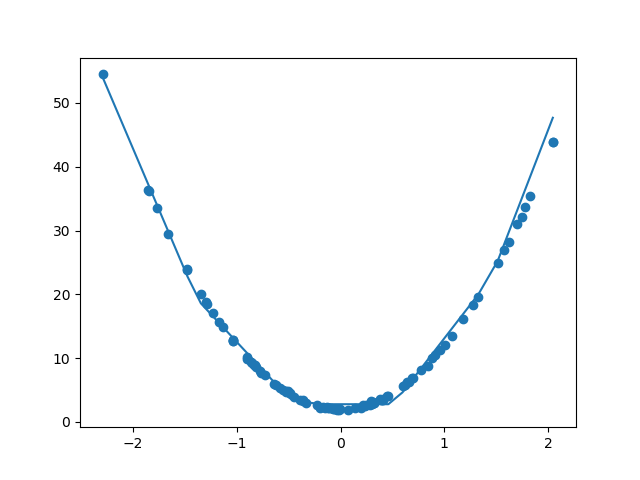
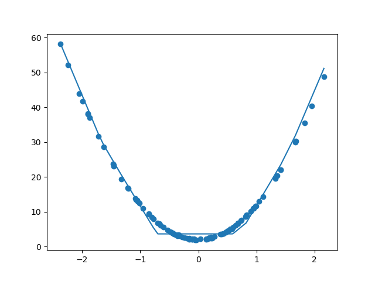

# Eve
The plan is as follows:
1. Prediction model for toy problem
2. Hyper prediction model for toy problem
3. Prediction model for mnist problem
4. Hyper prediction model for mnist problem
5. Hyper-hyper prediction model for toy problem
6. Hyper-hyper prediction model for mnist problem
7. Switch from backprop to evolutionary methods

Use fixed size networks. Only training the parameters, 
not the structure.

Residual structure? Both for hyper network and prediction 
network.

Consider changing the plan over the course of development.

## Chapter 1 - Prediction model for toy problem
* Train model using backprop
* Linear and quadratic toy problems
    * Single input
    * Single output
    * MSE error
* Network: 1x5, 5x5, 5x1
* ReLU activations

## Chapter 2 - Hyper prediction model for toy problem
Create network in chapter 1 using a hyper network.
* Hyper network: 5x10, 10x10, 10x1
* ReLU activations

## Chapter 3 - Prediction model for mnist problem
Adapted from the [pytorch mnist example](https://github.com/pytorch/examples/tree/master/mnist).

Original performance of network with convolutional layers:

    Average loss: 0.0545, Accuracy: 9834/10000 (98%)

After replacing with linear layers and decreasing size:

    Average loss: 0.2139, Accuracy: 9387/10000 (94%)
    
* Network 28x28x10, 10x10, 10x10

## Chapter 4 - Hyper prediction model for mnist problem
Create network in chapter 3 using a hyper network.
* Network 28x28x10, 10x10, 10x10
* Hyper network 5x50, 50x20, 20x20, 20x20, 20x20, 20x1 
  (around 1/4th of the weights of the network)

Hyper prediction model performance:

    Average loss: 0.5999, Accuracy: 8236/10000 (82%)

This is worse than a linear model. May be possible to get a 
lot better. At first it was stuck at 10% accuracy. It seems 
to be very sensitive. Added batch normalization

The end goal of residual hypernetworks should be simpler than the 
normal hyper networks? Only need to say what change we would like 
to see in the weights

## End goal
Changing environment?

Multiple agents, competition? Would create reasonable level of 
difficulty for further improvement and changing environment? A bit
like self-play?

## Thoughts

### Structure
Needs to be able to build itself.
* Build itself and solve a problem
* Build itself and another network, which solves a problem

### How should we handle the input features?
Would like to do one-hot encoding for everything but if combined
with a linear layer then there are more params than originally

* Index inputs
* One-hot encoding with adaptive pooling (and convolutional layers)
* Slice using indices - let model decide what the features should 
  look like. Output a matrix with upsampling/unpooling/conv and 
  slice it?

There are possibly several issues with the second option. One of 
them is the implementation with gradients

Residual networks should be simpler than the hyper networks?
Only need to say what change we would like to see in the weights

